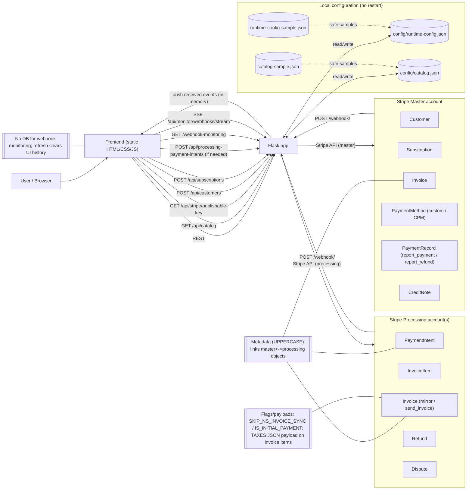

## Diagrams (Mermaid)

This file contains diagrams as **Mermaid** blocks.  
You can render them in most Markdown viewers that support Mermaid (GitHub, many IDEs, etc.).

---

### 1) Global architecture (accounts, services, and Stripe objects)

**Rendered image (PNG):**


**Mermaid source:**



---

### 2) End-to-end sequence (sync creation + async orchestration scenarios)

**Rendered image (PNG):**


**Mermaid source:**

```mermaid
---
config:
  look: classic
  theme: mc
---
sequenceDiagram
  autonumber
  participant U as User/Browser
  participant FE as Frontend
  participant APP as Flask app
  participant M as Stripe Master account
  participant P as Stripe Processing account

  %% ---- Sync flow ----
  rect rgb(255, 255, 255)
    Note over FE,APP: Load catalog & resolve routing
    FE->>APP: GET /api/catalog
    APP-->>FE: catalog.json (prices + account_alias)
    FE->>APP: GET /api/stripe/publishable-key?price_id=...
    APP->>APP: Read runtime-config.json (master alias + accounts)
    APP-->>FE: master+processing account info + publishable keys

    Note over FE,APP: Create customer (master)
    FE->>APP: POST /api/customers (name/email/address, price_id)
    APP->>M: customers.create(metadata: PROCESSING_ACCOUNT_ID, MASTER_ACCOUNT_ID, SELECTED_PRICE_ID, SELECTED_CURRENCY)
    M-->>APP: Customer(cus_...)
    APP-->>FE: stripe_customer_id + account ids

    Note over FE,APP: Create subscription (master, automatic tax enabled)
    FE->>APP: POST /api/subscriptions (stripe_customer_id, price_id)
    APP->>M: subscriptions.create(..., metadata includes SKIP_NS_INVOICE_SYNC when processing != master)
    M-->>APP: Subscription(sub_...) + latest_invoice(in_...) + payment_intent(pi_...) when available
    APP-->>FE: sub_id + invoice_id + hosted_invoice_url + totals (incl/excl tax) + client_secret when available
    alt processing != master
      APP->>M: invoices.update(latest_invoice_id, metadata.SKIP_NS_INVOICE_SYNC="true")
    end

    alt processing == master
      Note over FE,M: Pay on master using Stripe.js Payment Element
      FE->>M: confirmPayment(client_secret)
      M-->>FE: PaymentIntent succeeded
    else processing != master
      Note over FE,APP: Create processing PaymentIntent mirroring master invoice amount/currency
      FE->>APP: POST /api/processing-payment-intents(original_invoice_id, original_subscription_id)
      APP->>M: invoices.retrieve(original_invoice_id) -> amount_due/currency
      M-->>APP: Invoice totals
      APP->>P: payment_intents.create(amount,currency, customer, setup_future_usage=off_session, metadata: INITIAL_PAYMENT=true + MASTER_* links)
      P-->>APP: PaymentIntent(pi_...) + client_secret
      APP-->>FE: processing PI + client_secret + processing publishable key
      FE->>P: confirmPayment(processing client_secret)
      P-->>FE: PaymentIntent succeeded
    end
  end

  %% ---- Async orchestration ----
  rect rgb(173, 216, 230)
    Note over APP,M: Webhooks are received on /webhook/<ALIAS> and routed by alias (signature verified per alias)

    %% Scenario 1
    Note over P,APP: Scenario 1 (processing) — payment_intent.succeeded + INITIAL_PAYMENT=true
    P-->>APP: Webhook payment_intent.succeeded (processing PI)
    APP->>M: invoices.retrieve(MASTER_ACCOUNT_INVOICE_ID) -> MASTER_ACCOUNT_CUSTOMER_ID
    APP->>M: payment_methods.create(type=custom CPM, metadata: PROCESSING_ACCOUNT_PAYMENT_METHOD_ID, MASTER/PROCESSING customer ids)
    APP->>M: payment_methods.attach(pm_custom, customer)
    APP->>M: payment_records.report_payment(outcome=guaranteed, processor_details.custom.payment_reference=processing PI)
    APP->>M: invoices.attach_payment(master_invoice_id, payment_record)
    APP->>M: subscriptions.update(default_payment_method = master CPM)
    Note over APP,P: Create processing send_invoice invoice for downstream sync (tax breakdown)
    APP->>P: invoice_items.create(..., metadata.TAXES=JSON)
    APP->>P: invoices.create(collection_method=send_invoice, number=master invoice.number, metadata.IS_INITIAL_PAYMENT="true")
    APP->>P: invoices.line_items.update(..., tax_amounts=taxesData)
    APP->>P: invoices.finalize_invoice(processing_invoice_id)
    APP->>P: invoices.attach_payment(processing_invoice_id, payment_intent=processing PI)

    %% Scenario 2
    Note over M,APP: Scenario 2 (master) — invoice.payment_attempt_required
    M-->>APP: Webhook invoice.payment_attempt_required (master invoice)
    APP->>M: invoices.update(master_invoice_id, metadata.SKIP_NS_INVOICE_SYNC=<value>)  %% if present in subscription_details.metadata
    APP->>M: subscriptions.retrieve(expand default_payment_method)
    APP->>P: invoices.search/list by metadata MASTER_ACCOUNT_INVOICE_ID
    alt mirror invoice not found
      APP->>P: invoice_items.create(customer, currency, amount, description, period)
      APP->>P: invoices.create(collection_method=charge_automatically, default_payment_method=processing PM, metadata MASTER_* links)
      APP->>P: invoices.pay(off_session=true)
    else mirror invoice exists
      Note over APP: No-op
    end

    %% Scenario 3
    Note over P,APP: Scenario 3 (processing) — invoice.paid
    P-->>APP: Webhook invoice.paid (may omit fields)
    APP->>P: invoices.retrieve(processing_invoice_id)  %% source of truth
    alt processing_invoice.metadata.IS_INITIAL_PAYMENT == "true"
      Note over APP: Skip (initial payment already reported in Scenario 1)
    else
    APP->>M: subscriptions.retrieve(expand default_payment_method) -> master CPM id
    APP->>M: payment_records.report_payment(outcome=guaranteed, payment_method_details.payment_method=master CPM)
    APP->>M: invoices.attach_payment(master_invoice_id, payment_record)
    APP->>M: invoices.update(metadata.MASTER_ACCOUNT_PAYMENT_RECORD_ID=payment_record_id)
    end

    %% Scenario 4
    Note over P,APP: Scenario 4 (processing) — invoice.payment_failed
    P-->>APP: Webhook invoice.payment_failed
    APP->>P: invoices.retrieve(processing_invoice_id)  %% source of truth
    APP->>M: subscriptions.retrieve(expand default_payment_method) -> master CPM id
    APP->>M: payment_records.report_payment(outcome=failed, failed.failed_at=normalized_ts)
    APP->>M: invoices.attach_payment(master_invoice_id, payment_record)

    %% Scenario 5
    Note over P,APP: Scenario 5 (processing) — refund.created
    P-->>APP: Webhook refund.created
    APP->>P: payment_intents.retrieve(expand invoice)  %% fallback to PI metadata if no invoice
    APP->>M: invoices.retrieve(master_invoice_id) -> MASTER_ACCOUNT_PAYMENT_RECORD_ID (metadata)
    APP->>M: payment_records.report_refund(MASTER_ACCOUNT_PAYMENT_RECORD_ID, outcome=refunded, timestamps normalized, metadata PROCESSING_ACCOUNT_REFUND_ID)
    APP->>M: credit_notes.create(master_invoice_id, line_item, amount)

    %% Scenario 6
    Note over P,APP: Scenario 6 (processing) — charge.dispute.closed (lost)
    P-->>APP: Webhook charge.dispute.closed (status=lost)
    APP->>P: payment_intents.retrieve(expand invoice)
    APP->>M: invoices.retrieve(master_invoice_id) -> MASTER_ACCOUNT_PAYMENT_RECORD_ID
    APP->>M: payment_records.report_refund(... metadata PROCESSING_ACCOUNT_DISPUTE_ID)
    APP->>M: credit_notes.create(master_invoice_id, line_item, amount)

    %% Scenario 7
    Note over P,APP: Scenario 7 (processing) — customer.updated default PM changed
    P-->>APP: Webhook customer.updated (previous_attributes.invoice_settings.default_payment_method present)
    APP->>M: customers.payment_methods.list(customer, type=custom)
    loop for each master CPM
      APP->>M: payment_methods.update(metadata.PROCESSING_ACCOUNT_PAYMENT_METHOD_ID = new processing PM)
    end
  end


