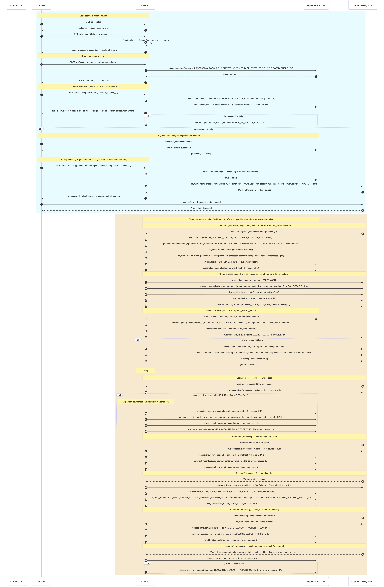

## Integration guide (Stripe multi-account orchestration)

This document is a **client-facing integration guide** for the multi-account Stripe orchestration implemented in this repository.

The system is designed around:
- a **Master** Stripe account (source of truth, subscription lifecycle),
- one or more **Processing** Stripe accounts (local payment processing, refunds/disputes),
- **webhook-driven orchestration** to synchronize state across accounts.

> Important: This project is intentionally **stateless** for webhook monitoring (no DB). Runtime configuration is stored in JSON files and can be live-edited.

---

### 1) Architecture concepts

#### Master account
The **Master account** is the account where the core subscription objects live.

- **Responsibilities**
  - Create and own **Customers** and **Subscriptions** (and therefore the “canonical” **Invoices**).
  - Store the “master truth” about what the customer is subscribed to and when billing occurs.
  - Represent external payment activity via **Payment Records** (reporting payments/refunds that happened elsewhere).
  - Own the “external payment method representation” as a **Custom PaymentMethod (CPM)** attached to the master customer.

- **Typical objects created/updated**
  - `Customer`
  - `Subscription`
  - `Invoice` (created by Stripe for subscription billing)
  - `PaymentMethod` (type `custom`)
  - `PaymentRecord` (`payment_records.report_payment`, `payment_records.report_refund`)
  - `CreditNote` (created when a processing-side refund/dispute occurs)

#### Processing accounts
A **Processing account** is any account used to actually process a payment in a given region/currency.

- **Responsibilities**
  - Receive “mirror invoices” (created from master invoice data) and attempt payment locally.
  - Host **PaymentIntents** for local payment collection.
  - Generate local events such as `invoice.paid`, `invoice.payment_failed`, `refund.created`, `charge.dispute.closed`.

- **Typical objects created/updated**
  - `InvoiceItem`
  - `Invoice` (mirror invoice)
  - `PaymentIntent` (processing-side)
  - `Refund` / `Dispute` (as a consequence of local processing activity)

#### Webhook endpoints per account
Each Stripe account is configured to send webhooks to the same application, but to an alias-specific route:

- `POST /webhook/<ALIAS>` (examples: `/webhook/EU`, `/webhook/US`, `/webhook/BR`)

This makes webhook signature verification deterministic (the alias in the URL selects the right signing secret).

#### Runtime configuration (no restart)
Stripe accounts, keys, webhook signing secrets, CPM types, and the master alias are stored in:
- `config/runtime-config.json` (local, gitignored)

The product catalog (prices and routing aliases) is stored in:
- `config/catalog.json` (local, gitignored)

Safe-to-share samples are included:
- `config/runtime-config-sample.json`
- `config/catalog-sample.json`

You can edit config live from:
- `GET /config` (Basic Auth; password configured via `.env` with `ADMIN_PASSWORD`)

---

### 2) Data model (Stripe objects + metadata)

#### Global metadata rule
- **All Stripe metadata keys are UPPERCASE**.
- Metadata is used to:
  - link master objects ↔ processing objects,
  - locate “peer” objects during webhook processing,
  - keep workflows traceable and recoverable.

Below is the complete set of objects and metadata written by this project.

---

#### Master account objects

##### A) `Customer` (master)
**Created by**: `POST /api/customers` → `master_client.v1.customers.create(...)`

**Metadata written**
- `PROCESSING_ACCOUNT_ID`: processing `acct_...` chosen for this customer’s subscription/payment
- `MASTER_ACCOUNT_ID`: master `acct_...`
- `SELECTED_PRICE_ID`: `price_...`
- `SELECTED_CURRENCY`: `eur|usd|gbp|...`

##### B) `Subscription` (master)
**Created by**: `POST /api/subscriptions` → `master_client.v1.subscriptions.create(...)`

**Metadata written**
- `PROCESSING_ACCOUNT_ID`
- `MASTER_ACCOUNT_ID`
- `SELECTED_PRICE_ID`
- `SELECTED_CURRENCY`

##### C) `Invoice` (master)
Invoices are created by Stripe as part of subscription billing.

**Metadata written/updated**
- In Scenario #3 (processing invoice paid): `MASTER_ACCOUNT_PAYMENT_RECORD_ID` is written on the master invoice to link it to the master PaymentRecord.

##### D) `PaymentMethod` (master) — Custom Payment Method (CPM)

This project creates a **custom** PaymentMethod on the master account to represent the processing-side payment method.

**Created by**: Scenario #1 (`payment_intent.succeeded` on processing with `INITIAL_PAYMENT="true"`)
- `master_client.v1.payment_methods.create({ type: "custom", custom: { type: <CPM_TYPE> }, metadata: {...} })`
- `master_client.v1.payment_methods.attach(pm_id, { customer: <MASTER_CUSTOMER_ID> })`

**Metadata written on the master CPM**
- `PROCESSING_ACCOUNT_PAYMENT_METHOD_ID`: the processing-side `pm_...` to charge later on processing
- `MASTER_ACCOUNT_CUSTOMER_ID`: master `cus_...`
- `PROCESSING_ACCOUNT_CUSTOMER_ID`: processing/customer id (same logical customer, in a shared setup it can match)

**Updated by**: Scenario #7 (`customer.updated` on processing)
- `master_client.v1.payment_methods.update(pm_id, { metadata: { PROCESSING_ACCOUNT_PAYMENT_METHOD_ID: <new_pm> } })`

Also available via an admin endpoint:
- `POST /api/payment-methods/update-processing-metadata`

##### E) `PaymentRecord` (master)
Payment Records are used to **report external activity** (payments/refunds) that happened on a processing account.

**Created by**
- Scenario #1: `payment_records.report_payment` (outcome **guaranteed**)
- Scenario #3: `payment_records.report_payment` (outcome **guaranteed**)
- Scenario #4: `payment_records.report_payment` (outcome **failed**)
- Scenario #5/#6: `payment_records.report_refund` (outcome **refunded**)

**Metadata written**
- On `report_payment` (scenario-dependent):
  - `PROCESSING_ACCOUNT_PAYMENT_INTENT_ID`
  - `PROCESSING_ACCOUNT_PAYMENT_METHOD_ID` (scenarios #3/#4)
  - `MASTER_ACCOUNT_ID`
  - `MASTER_ACCOUNT_INVOICE_ID`
  - `MASTER_ACCOUNT_SUBSCRIPTION_ID`
- On `report_refund`:
  - `PROCESSING_ACCOUNT_REFUND_ID` (scenario #5) **or**
  - `PROCESSING_ACCOUNT_DISPUTE_ID` (scenario #6)

**Linkage**
- PaymentRecord is attached to the master invoice:
  - `master_client.v1.invoices.attach_payment(master_invoice_id, { payment_record: <payment_record_id> })`
- The id is persisted on the master invoice metadata:
  - `metadata.MASTER_ACCOUNT_PAYMENT_RECORD_ID = <payment_record_id>`

##### F) `CreditNote` (master)
Used to represent refunds/disputes (from processing) against the master invoice line items.

**Created by**
- Scenario #5 and #6: create a credit note for the master invoice’s first line item (amount = refunded/disputed amount).

---

#### Processing account objects

##### A) `PaymentIntent` (processing)
**Created by**: `POST /api/processing-payment-intents`
- `processing_client.v1.payment_intents.create({ amount, currency, customer, setup_future_usage, metadata, ... })`

**Metadata written**
- `INITIAL_PAYMENT="true"`
- `MASTER_ACCOUNT_ID`
- `MASTER_ACCOUNT_INVOICE_ID`
- `MASTER_ACCOUNT_SUBSCRIPTION_ID`
- `MASTER_ACCOUNT_CUSTOMER_ID`

This metadata is used later by Scenario #1 (and also as a fallback for refunds/disputes when no invoice is present on the PaymentIntent).

##### B) `InvoiceItem` and `Invoice` (processing) — mirror billing
**Created by**: Scenario #2 (`invoice.payment_attempt_required` on master)

1) `processing_client.v1.invoice_items.create(...)`
2) `processing_client.v1.invoices.create(...)`
3) `processing_client.v1.invoices.pay(processing_invoice_id, ...)`

**Metadata written on the processing invoice**
- `MASTER_ACCOUNT_INVOICE_ID`
- `MASTER_ACCOUNT_CUSTOMER_ID`
- `MASTER_ACCOUNT_SUBSCRIPTION_ID`
- `MASTER_ACCOUNT_ID`

This metadata is used by Scenario #3/#4 to locate the master invoice/subscription/customer.

##### C) `Refund` / `Dispute` (processing)
Refunds and disputes are created by Stripe as a consequence of processing-side payment activity.

They are reported back to the master via:
- Scenario #5: `refund.created` → `payment_records.report_refund(...)` + master credit note
- Scenario #6: `charge.dispute.closed` (lost) → `payment_records.report_refund(...)` + master credit note

---

### 3) Synchronous subscription creation workflow (frontend → backend → Stripe)

This section describes the **synchronous** flow a client follows to create a subscription and reach an invoice that can be paid.

#### Step 0 — Catalog & routing (frontend)
1) Frontend fetches the product catalog:
   - `GET /api/catalog` → reads `config/catalog.json`
2) Frontend asks which master/processing accounts apply to a selected price:
   - `GET /api/stripe/publishable-key?price_id=price_...`

This response includes:
- master account alias + account id
- processing account id + optional `country` (flag UI)
- the publishable key to initialize Stripe.js (master key for the main flow)

#### Step 1 — Create Customer (backend on master)
Frontend calls:
- `POST /api/customers`

Backend performs (on **master** account):
- `customers.create` with:
  - name/email/address details
  - metadata: `PROCESSING_ACCOUNT_ID`, `MASTER_ACCOUNT_ID`, `SELECTED_PRICE_ID`, `SELECTED_CURRENCY`

Backend returns:
- `stripe_customer_id`
- `created_on_account_id` (master acct)
- `processing_account_id`

#### Step 2 — Create Subscription (backend on master)
Frontend calls:
- `POST /api/subscriptions` with:
  - `price_id`
  - `stripe_customer_id`

Backend performs (on **master** account):
- `subscriptions.create` with:
  - `customer = <stripe_customer_id>`
  - `items = [{ price: <price_id>, quantity: 1 }]`
  - `collection_method = "charge_automatically"`
  - `payment_behavior = "default_incomplete"`
  - `payment_settings.save_default_payment_method = "on_subscription"`
  - `automatic_tax.enabled = true`
  - metadata: `PROCESSING_ACCOUNT_ID`, `MASTER_ACCOUNT_ID`, `SELECTED_PRICE_ID`, `SELECTED_CURRENCY`
  - expand: `latest_invoice`, `latest_invoice.payment_intent`, `latest_invoice.confirmation_secret`, `pending_setup_intent`

Backend returns (subset):
- `stripe_subscription_id`
- `status`
- `latest_invoice_id`
- `hosted_invoice_url`
- invoice amounts:
  - `invoice_currency`
  - `invoice_total` (incl. tax)
  - `invoice_total_excluding_tax`
  - `invoice_taxable_amount` (sum of `invoice.total_taxes[].taxable_amount` when present)
- PaymentIntent details:
  - `payment_intent_id`
  - `payment_intent_client_secret` (or invoice `confirmation_secret.client_secret`)
- account ids:
  - `created_on_account_id` (master)
  - `processing_account_id`

#### Step 3 — Payment collection (depends on routing)

**Case A — processing == master**
- Frontend uses the returned `payment_intent_client_secret` with Stripe.js Payment Element
- Confirms payment:
  - `stripe.confirmPayment(...)`

**Case B — processing != master**
Frontend calls:
- `POST /api/processing-payment-intents` with:
  - `price_id`
  - `stripe_customer_id`
  - `original_invoice_id = <master latest_invoice_id>`
  - `original_subscription_id = <master subscription id>`

Backend performs:
1) On **master**: retrieve the master invoice to compute amount/currency source of truth
   - `invoices.retrieve(original_invoice_id)`
2) On **processing**: create a matching PaymentIntent
   - `payment_intents.create({ amount, currency, customer, setup_future_usage: "off_session", metadata: {...} })`

Frontend then initializes Stripe.js with the **processing publishable key** and confirms that processing PaymentIntent.

---

### 4) Asynchronous workflows (webhook-driven orchestration)

All asynchronous workflows are triggered by Stripe webhooks received on:
- `POST /webhook/<ALIAS>`

Verification:
- the endpoint uses `accounts[ALIAS].webhook_signing_secret` from `config/runtime-config.json`.

General implementation notes:
- **No DB** is used for orchestration; Stripe metadata is the linkage mechanism.
- For payment reporting timestamps, a normalization is applied:
  - if a timestamp is in the future, it is clamped to `now - 10 seconds` (Stripe rejects future timestamps for Payment Records).

---

#### Scenario 1 — Initial payment on processing account
- **Origin account**: Processing
- **Event**: `payment_intent.succeeded`
- **Condition**: `data.object.metadata.INITIAL_PAYMENT == "true"`

**Goal**
- Create and attach a master custom PaymentMethod representing the processing payment method.
- Report the processing payment on the master invoice via `PaymentRecord`.

**Processing-side inputs (from webhook PI)**
- `PROCESSING_ACCOUNT_PAYMENT_INTENT_ID = data.object.id`
- `PROCESSING_ACCOUNT_PAYMENT_METHOD_ID = data.object.payment_method`
- `MASTER_ACCOUNT_ID`, `MASTER_ACCOUNT_INVOICE_ID`, `MASTER_ACCOUNT_SUBSCRIPTION_ID` from PI metadata
- `amount` / `currency` from the PaymentIntent

**Stripe calls**
- On **master**:
  1) Retrieve master invoice to get `MASTER_ACCOUNT_CUSTOMER_ID`
     - `invoices.retrieve(MASTER_ACCOUNT_INVOICE_ID)`
  2) Create master CPM
     - `payment_methods.create({ type:"custom", custom:{type:<CPM_TYPE>}, metadata:{ PROCESSING_ACCOUNT_PAYMENT_METHOD_ID, MASTER_ACCOUNT_CUSTOMER_ID, PROCESSING_ACCOUNT_CUSTOMER_ID } })`
  3) Attach CPM to master customer
     - `payment_methods.attach(pm_id, { customer: MASTER_ACCOUNT_CUSTOMER_ID })`
  4) Report payment as guaranteed
     - `payment_records.report_payment({ amount_requested:{currency,value}, initiated_at, outcome:"guaranteed", guaranteed:{guaranteed_at}, metadata:{...}, processor_details:{type:"custom", custom:{payment_reference: PROCESSING_ACCOUNT_PAYMENT_INTENT_ID}} })`
  5) Attach PaymentRecord to master invoice
     - `invoices.attach_payment(MASTER_ACCOUNT_INVOICE_ID, { payment_record: <id> })`
  6) Set the master subscription `default_payment_method = <master CPM>`

---

#### Scenario 2 — Payment attempt required on master (mirror invoice on processing)
- **Origin account**: Master
- **Event**: `invoice.payment_attempt_required`

**Goal**
- Create an equivalent invoice on the processing account and attempt payment there.

**Inputs extracted**
- From master invoice (webhook): invoice id/currency/amount/period/description
- From parent subscription details: `MASTER_ACCOUNT_SUBSCRIPTION_ID` and `PROCESSING_ACCOUNT_ID`
- From master subscription default PM metadata:
  - `PROCESSING_ACCOUNT_PAYMENT_METHOD_ID`
  - `PROCESSING_ACCOUNT_CUSTOMER_ID`

**Stripe calls**
- On **master**:
  1) Retrieve master subscription with expand default PM
     - `subscriptions.retrieve(MASTER_ACCOUNT_SUBSCRIPTION_ID, { expand:["default_payment_method"] })`
- On **processing**:
  2) Find existing mirror invoice with metadata `MASTER_ACCOUNT_INVOICE_ID`
  3) If missing:
     - `invoice_items.create({ customer, currency, amount, description, period })`
     - `invoices.create({ customer, currency, collection_method:"charge_automatically", pending_invoice_items_behavior:"include", default_payment_method:<processing pm>, metadata:{...} })`
     - `invoices.pay(processing_invoice_id, { off_session: true })`

---

#### Scenario 3 — Invoice paid on processing account (report payment on master)
- **Origin account**: Processing
- **Event**: `invoice.paid`

**Goal**
- Report the successful processing payment on master via PaymentRecord, attach it to master invoice, and store linkage metadata.

**Robustness note**
Some webhook payloads may omit invoice fields. The implementation uses:
- `processing_client.v1.invoices.retrieve(processing_invoice_id)`
as the source of truth.

**Stripe calls**
- On **processing**:
  1) `invoices.retrieve(processing_invoice_id)` (to read payment method, payment intent, timestamps, metadata)
- On **master**:
  2) `subscriptions.retrieve(master_subscription_id, { expand:["default_payment_method"] })`
  3) `payment_records.report_payment(...)` (outcome guaranteed)
  4) `invoices.attach_payment(master_invoice_id, { payment_record: <id> })`
  5) `invoices.update(master_invoice_id, { metadata: { MASTER_ACCOUNT_PAYMENT_RECORD_ID: <id> } })`

---

#### Scenario 4 — Invoice payment failed on processing account (report failed payment on master)
- **Origin account**: Processing
- **Event**: `invoice.payment_failed`

**Goal**
- Report the failed processing payment attempt on master via PaymentRecord (outcome `failed`) and attach it to the master invoice.

**Stripe calls**
- On **processing**:
  1) `invoices.retrieve(processing_invoice_id)` (to read payment method, payment intent, best timestamp, amounts, metadata)
- On **master**:
  2) `subscriptions.retrieve(master_subscription_id, { expand:["default_payment_method"] })`
  3) `payment_records.report_payment({ outcome:"failed", failed:{failed_at}, ... })`
  4) `invoices.attach_payment(master_invoice_id, { payment_record: <id> })`

---

#### Scenario 5 — Refund on processing account (report refund on master + credit note)
- **Origin account**: Processing
- **Event**: `refund.created` (and/or refund-related events depending on Stripe configuration)

**Goal**
- Report the refund against the master PaymentRecord and create a master credit note.

**Stripe calls**
- On **processing**:
  1) Retrieve PaymentIntent (with `expand=["invoice"]` when applicable)
  2) Extract master linkage metadata (from invoice metadata, with fallback to PI metadata)
- On **master**:
  3) Retrieve master invoice to get `MASTER_ACCOUNT_PAYMENT_RECORD_ID` from invoice metadata
  4) `payment_records.report_refund(MASTER_ACCOUNT_PAYMENT_RECORD_ID, { ... outcome:"refunded", amount, initiated_at, refunded:{refunded_at}, metadata:{ PROCESSING_ACCOUNT_REFUND_ID } })`
  5) Create a credit note for the master invoice line item (amount = refunded amount)

---

#### Scenario 6 — Lost dispute on processing account (report refund on master + credit note)
- **Origin account**: Processing
- **Event**: `charge.dispute.closed`
- **Condition**: `data.object.status == "lost"`

**Goal**
- Same as scenario #5, but the reference is a dispute id.

**Stripe calls**
- On **processing**:
  1) Retrieve PaymentIntent, extract master linkage metadata
- On **master**:
  2) Retrieve master invoice → read `MASTER_ACCOUNT_PAYMENT_RECORD_ID`
  3) `payment_records.report_refund(... metadata:{ PROCESSING_ACCOUNT_DISPUTE_ID })`
  4) Create a master credit note for the invoice line item

---

#### Scenario 7 — Customer default payment method changed on processing account (sync to master CPM)
- **Origin account**: Processing
- **Event**: `customer.updated`
- **Condition**: `data.previous_attributes.invoice_settings.default_payment_method` is present

**Goal**
- When the customer changes the default payment method on processing, update the master CPM metadata so future processing charges use the new processing PM.

**Stripe calls**
- On **master**:
  1) List the customer’s custom payment methods:
     - `customers.payment_methods.list(PROCESSING_ACCOUNT_CUSTOMER_ID, { type:"custom" })`
  2) Update each CPM:
     - `payment_methods.update(pm_id, { metadata:{ PROCESSING_ACCOUNT_PAYMENT_METHOD_ID: <new_processing_pm> } })`

---

### Appendix — Useful built-in pages

- **Admin configuration UI**
  - `GET /config` (Basic Auth)
  - Reads/writes:
    - `config/runtime-config.json`
    - `config/catalog.json`

- **Webhook monitoring (real-time, no persistence)**
  - `GET /webhook-monitoring`
  - SSE stream: `GET /api/monitor/webhooks/stream`

### Appendix — Diagrams

See [`diagrams.md`](diagrams.md) for Mermaid diagrams:
- Global architecture
- End-to-end sequence (sync + async scenarios)

Rendered images (PNG):
- 
- 

